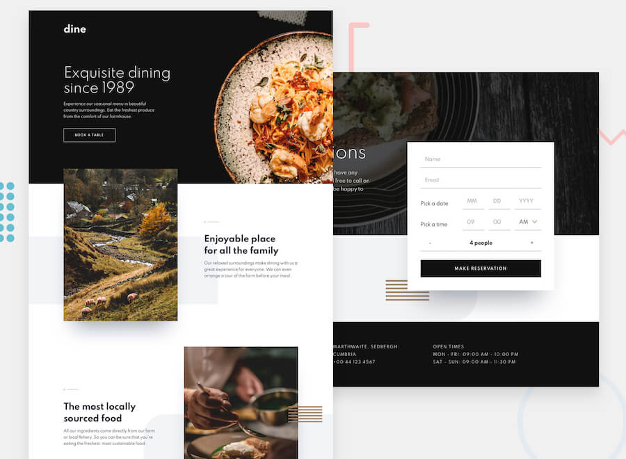

# Frontend Mentor - Dine Website Challenge solution

This is a solution to the [Dine Website Challenge challenge on Frontend Mentor](https://www.frontendmentor.io/challenges/dine-restaurant-website-yAt7Vvxt7). Frontend Mentor challenges help you improve your coding skills by building realistic projects. 

## Table of contents

- [Overview](#overview)
  - [The challenge](#the-challenge)
  - [Links](#links)
- [My process](#my-process)
  - [Built with](#built-with)
  - [What I learned](#what-i-learned)
- [Author](#author)

## Overview

### The challenge

Users should be able to:

- View the optimal layout for each page depending on their device's screen size
- See hover states for all interactive elements throughout the site
- See the correct content for the Family Gatherings, Special Events, and Social Events section when the user clicks each tab
- Receive an error message when the booking form is submitted if:
  - The `Name` or `Email Address` fields are empty should show "This field is required"
  - The `Email Address` is not formatted correctly should show "Please use a valid email address"
  - Any of the `Pick a date` or `Pick a time` fields are empty should show "This field is incomplete"

### Links

- Solution URL: [https://github.com/MartineauRemi/Dine](https://github.com/MartineauRemi/Dine)
- Live Site URL: [https://martineauremi.github.io/Dine/](https://martineauremi.github.io/Dine/)

## My process

### Built with

- Semantic HTML5 markup
- CSS custom properties
- Flexbox
- CSS Grid
- Mobile-first workflow
- Javascript
- Intersection Observer API and lazy-loading images

### What I learned

I learned how to do a solid form validation with Javascript.

## Author

- Website - [Rémi Martineau](https://martineauremi.github.io/)
- Linkedin - [Rémi Martineau](https://www.linkedin.com/in/r%C3%A9mi-martineau-25a54b12a)
- Frontend Mentor - [@MartineauRemi](https://www.frontendmentor.io/profile/MartineauRemi)
- Twitter - [@MartineauRmi1](https://twitter.com/MartineauRmi1)
